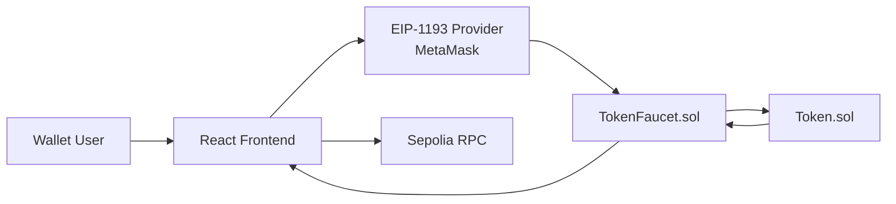
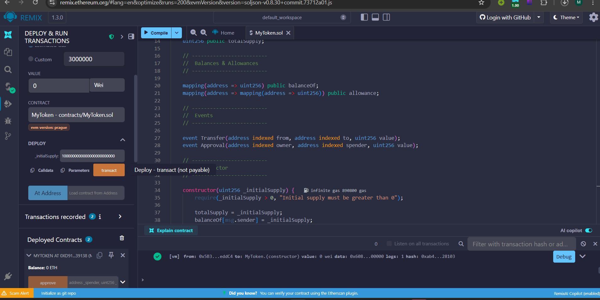
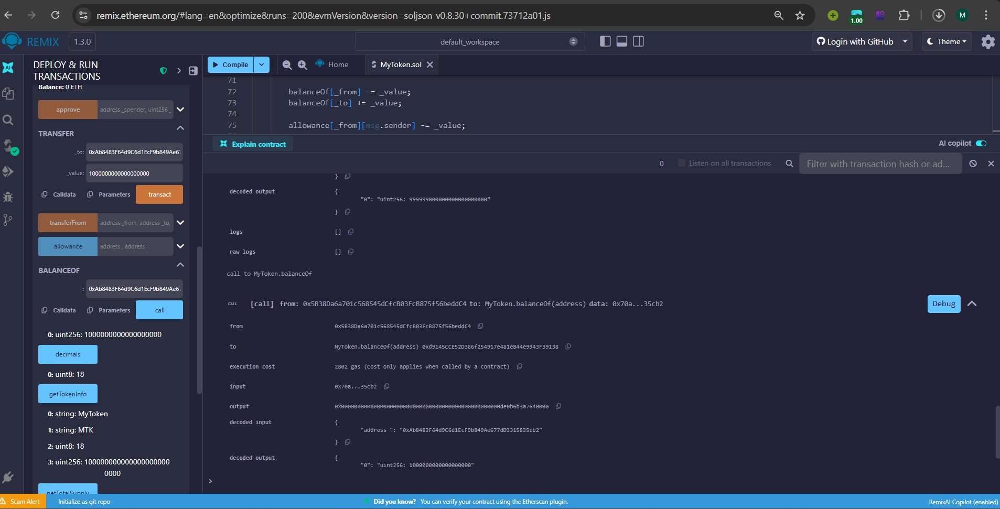
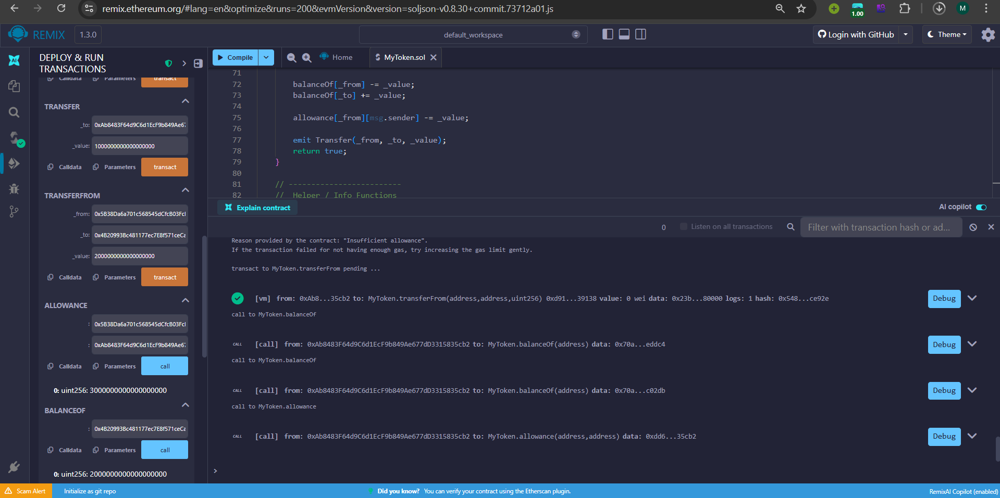
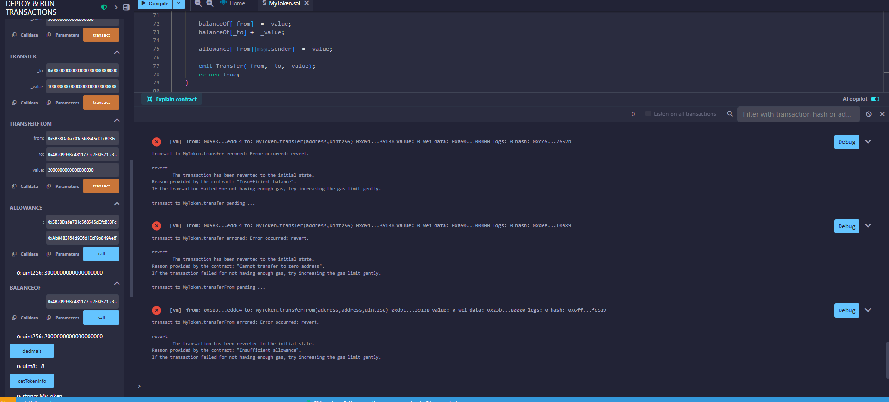
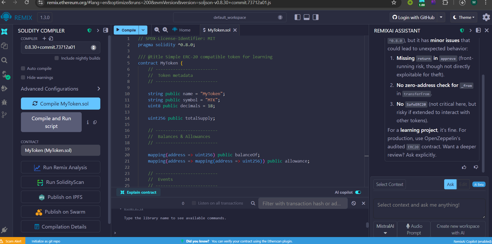

# Token Faucet DApp (Submission)

## Project Overview
This project is a complete Web3 faucet DApp with an ERC-20 token and an on-chain rate-limited faucet.
It demonstrates smart contract security controls (cooldown, lifetime caps, pause), EIP-1193 wallet integration, transaction lifecycle UX, Dockerized deployment, and a deterministic evaluation interface via `window.__EVAL__`.

## Architecture
- `contracts/Token.sol`: OpenZeppelin ERC-20 token with fixed `MAX_SUPPLY` and faucet-only minting.
- `contracts/TokenFaucet.sol`: faucet business logic with:
  - fixed claim amount (`FAUCET_AMOUNT`)
  - exact 24h cooldown (`COOLDOWN_TIME`)
  - per-address lifetime cap (`MAX_CLAIM_AMOUNT`)
  - admin pause/unpause and explicit revert messages
  - public `lastClaimAt` and `totalClaimed`
- `frontend/`: React + ethers.js app with wallet connect/disconnect, claim flow, status polling, and event-driven updates.
- `scripts/deploy.js`: deploy token + faucet, grant minter, optional Etherscan verification, output `deployment.json`.

### Architecture Diagram


## Deployed Contracts (Sepolia)
Replace with your final verified addresses after deployment.

- Token: `0xYourTokenAddress`  
  Etherscan: https://sepolia.etherscan.io/address/0xYourTokenAddress
- Faucet: `0xYourFaucetAddress`  
  Etherscan: https://sepolia.etherscan.io/address/0xYourFaucetAddress

## Quick Start
```bash
cd submission
cp .env.example .env
# Edit .env with real values

npm install
npm run compile
npm test

cd frontend
npm install
npm run build
cd ..

docker compose up --build
```

Open: http://localhost:3000  
Health: http://localhost:3000/health

## Configuration
- `SEPOLIA_RPC_URL`: RPC endpoint for deployment and reads.
- `PRIVATE_KEY`: deployer private key for Hardhat scripts.
- `ETHERSCAN_API_KEY`: used by verify plugin.
- `VERIFY_ON_DEPLOY`: `true` to verify during deployment.
- `VITE_RPC_URL`: frontend read RPC.
- `VITE_TOKEN_ADDRESS`: deployed token address.
- `VITE_FAUCET_ADDRESS`: deployed faucet address.

## Smart Contract Design Decisions
- Faucet amount: `100 * 10^18` per request for meaningful balances while keeping gas low.
- Lifetime cap: `1000 * 10^18` (10 successful claims max) to prevent faucet abuse.
- Max supply: `1,000,000 * 10^18` for deterministic mint ceiling and clear supply economics.
- Security: checks-effects-interactions, admin access control, explicit revert reasons, `ReentrancyGuard`.

## Testing Approach
Tests in `contracts/test/TokenFaucet.test.js` cover:
- deployment and initial states
- successful claims and event emission
- cooldown enforcement with time manipulation
- lifetime cap enforcement
- pause behavior + admin-only controls
- user isolation (independent claim tracking)
- max supply exhaustion path and clear revert

## Frontend Evaluation Interface
`window.__EVAL__` functions available:
- `connectWallet(): Promise<string>`
- `requestTokens(): Promise<string>` (transaction hash)
- `getBalance(address): Promise<string>`
- `canClaim(address): Promise<boolean>`
- `getRemainingAllowance(address): Promise<string>`
- `getContractAddresses(): Promise<{ token: string, faucet: string }>`

All numeric values return as strings.

## Screenshots
Embed captured screenshots from `screenshots/`:











## Video Demonstration
Add your public video URL here (2-5 minutes):
- https://your-video-link.example

## Security Considerations
- Only faucet can mint token supply.
- Faucet enforces immutable cooldown and lifetime limits on-chain.
- Admin pause gate for emergency control.
- Clear revert messages for operational visibility.
- No centralized backend trust required for distribution policy.

## Known Limitations
- UI does not include admin pause panel (contract function exists and is tested).
- Wallet “disconnect” in browser can only clear local UI state (provider session is wallet-managed).
- Real-time updates rely on provider/event support of selected wallet/RPC.

## Contract Deployment & Verification
```bash
cd submission
npm install
npm run deploy:sepolia
# optional automatic verify when VERIFY_ON_DEPLOY=true
```

Manual verify if needed:
```bash
npx hardhat verify --network sepolia <TOKEN_ADDRESS>
npx hardhat verify --network sepolia <FAUCET_ADDRESS> <TOKEN_ADDRESS>
```

## Submission Checklist
- [ ] Deploy contracts to Sepolia
- [ ] Verify both contracts on Etherscan
- [ ] Fill deployed addresses in this README and `.env`
- [ ] Capture and embed final screenshots
- [ ] Add video demo link
- [ ] Confirm `docker compose up` serves app at port 3000
- [ ] Confirm `/health` returns HTTP 200
- [ ] Confirm all `window.__EVAL__` functions from browser console
